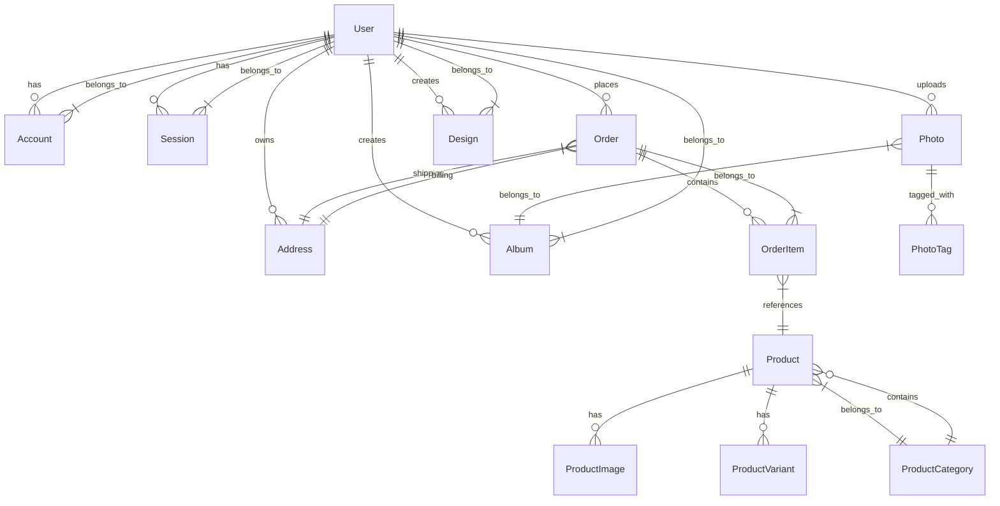

# Database Schema

## Overview

The Photo Book Creator application uses PostgreSQL as its primary database with Prisma ORM for schema management and data access. This document describes the database schema in detail, including tables, relationships, and constraints.

## Entity Relationship Diagram



## Tables

### User

The User table stores information about registered users.

| Column | Type | Constraints | Description |
|--------|------|-------------|-------------|
| id | String (CUID) | Primary Key | Unique identifier for the user |
| email | String | Unique, Not Null | User's email address |
| password | String | Nullable | Hashed password |
| name | String | Nullable | User's full name |
| image | String | Nullable | URL to user's profile image |
| emailVerified | DateTime | Nullable | Timestamp when email was verified |
| createdAt | DateTime | Not Null, Default: now() | Timestamp when user was created |
| updatedAt | DateTime | Not Null, Default: now() | Timestamp when user was last updated |

### Account

The Account table stores OAuth account information for users.

| Column | Type | Constraints | Description |
|--------|------|-------------|-------------|
| id | String (CUID) | Primary Key | Unique identifier for the account |
| userId | String | Foreign Key (User.id), Not Null, Cascade Delete | Reference to the user |
| type | String | Not Null | Type of account (oauth, email, etc.) |
| provider | String | Not Null | OAuth provider (Google, Facebook, etc.) |
| providerAccountId | String | Not Null | Provider-specific account ID |
| refresh_token | String | Nullable | OAuth refresh token |
| access_token | String | Nullable | OAuth access token |
| expires_at | Int | Nullable | Token expiration timestamp |
| token_type | String | Nullable | Type of token |
| scope | String | Nullable | OAuth scope |
| id_token | String | Nullable | ID token |
| session_state | String | Nullable | Session state |
| createdAt | DateTime | Not Null, Default: now() | Timestamp when account was created |
| updatedAt | DateTime | Not Null, Default: now() | Timestamp when account was last updated |

**Indexes:**
- Unique constraint on (provider, providerAccountId)

### Session

The Session table stores user session information.

| Column | Type | Constraints | Description |
|--------|------|-------------|-------------|
| id | String (CUID) | Primary Key | Unique identifier for the session |
| sessionToken | String | Unique, Not Null | Session token |
| userId | String | Foreign Key (User.id), Not Null, Cascade Delete | Reference to the user |
| expires | DateTime | Not Null | Session expiration timestamp |
| createdAt | DateTime | Not Null, Default: now() | Timestamp when session was created |
| updatedAt | DateTime | Not Null, Default: now() | Timestamp when session was last updated |

**Indexes:**
- Unique constraint on sessionToken

### VerificationToken

The VerificationToken table stores email verification tokens.

| Column | Type | Constraints | Description |
|--------|------|-------------|-------------|
| identifier | String | Primary Key (composite) | Identifier (usually email) |
| token | String | Primary Key (composite), Unique | Verification token |
| expires | DateTime | Not Null | Token expiration timestamp |

### Address

The Address table stores user address information.

| Column | Type | Constraints | Description |
|--------|------|-------------|-------------|
| id | String (CUID) | Primary Key | Unique identifier for the address |
| userId | String | Foreign Key (User.id), Not Null, Cascade Delete | Reference to the user |
| name | String | Nullable | Address name/label |
| street | String | Not Null | Street address |
| city | String | Not Null | City |
| state | String | Not Null | State/Province |
| zipCode | String | Not Null | ZIP/Postal code |
| country | String | Not Null | Country |
| isDefault | Boolean | Not Null, Default: false | Whether this is the default address |
| createdAt | DateTime | Not Null, Default: now() | Timestamp when address was created |
| updatedAt | DateTime | Not Null, Default: now() | Timestamp when address was last updated |

### Order

The Order table stores information about user orders.

| Column | Type | Constraints | Description |
|--------|------|-------------|-------------|
| id | String (CUID) | Primary Key | Unique identifier for the order |
| userId | String | Foreign Key (User.id), Not Null, Cascade Delete | Reference to the user |
| status | OrderStatus (Enum) | Not Null, Default: PENDING | Order status |
| totalAmount | Float | Not Null | Total order amount |
| taxAmount | Float | Not Null, Default: 0 | Tax amount |
| discount | Float | Not Null, Default: 0 | Discount amount |
| currency | String | Not Null, Default: USD | Currency code |
| paymentId | String | Nullable | Payment provider ID |
| shippingAddressId | String | Foreign Key (Address.id), Nullable | Reference to shipping address |
| billingAddressId | String | Foreign Key (Address.id), Nullable | Reference to billing address |
| trackingNumber | String | Nullable | Shipping tracking number |
| createdAt | DateTime | Not Null, Default: now() | Timestamp when order was created |
| updatedAt | DateTime | Not Null, Default: now() | Timestamp when order was last updated |

### OrderItem

The OrderItem table stores individual items within an order.

| Column | Type | Constraints | Description |
|--------|------|-------------|-------------|
| id | String (CUID) | Primary Key | Unique identifier for the order item |
| orderId | String | Foreign Key (Order.id), Not Null, Cascade Delete | Reference to the order |
| productId | String | Foreign Key (Product.id), Not Null | Reference to the product |
| quantity | Int | Not Null | Quantity of the product |
| price | Float | Not Null | Price per unit |
| createdAt | DateTime | Not Null, Default: now() | Timestamp when order item was created |
| updatedAt | DateTime | Not Null, Default: now() | Timestamp when order item was last updated |

### Product

The Product table stores information about available products.

| Column | Type | Constraints | Description |
|--------|------|-------------|-------------|
| id | String (CUID) | Primary Key | Unique identifier for the product |
| name | String | Not Null | Product name |
| description | String | Nullable | Product description |
| price | Float | Not Null | Base price |
| categoryId | String | Foreign Key (ProductCategory.id), Not Null | Reference to the product category |
| isActive | Boolean | Not Null, Default: true | Whether the product is active |
| createdAt | DateTime | Not Null, Default: now() | Timestamp when product was created |
| updatedAt | DateTime | Not Null, Default: now() | Timestamp when product was last updated |

### ProductCategory

The ProductCategory table stores product categories.

| Column | Type | Constraints | Description |
|--------|------|-------------|-------------|
| id | String (CUID) | Primary Key | Unique identifier for the category |
| name | String | Not Null | Category name |
| slug | String | Unique, Not Null | URL-friendly category name |
| description | String | Nullable | Category description |
| createdAt | DateTime | Not Null, Default: now() | Timestamp when category was created |
| updatedAt | DateTime | Not Null, Default: now() | Timestamp when category was last updated |

### ProductImage

The ProductImage table stores images associated with products.

| Column | Type | Constraints | Description |
|--------|------|-------------|-------------|
| id | String (CUID) | Primary Key | Unique identifier for the image |
| productId | String | Foreign Key (Product.id), Not Null, Cascade Delete | Reference to the product |
| url | String | Not Null | Image URL |
| alt | String | Nullable | Alternative text for the image |
| isPrimary | Boolean | Not Null, Default: false | Whether this is the primary image |
| createdAt | DateTime | Not Null, Default: now() | Timestamp when image was created |
| updatedAt | DateTime | Not Null, Default: now() | Timestamp when image was last updated |

### ProductVariant

The ProductVariant table stores product variants (different options for the same product).

| Column | Type | Constraints | Description |
|--------|------|-------------|-------------|
| id | String (CUID) | Primary Key | Unique identifier for the variant |
| productId | String | Foreign Key (Product.id), Not Null, Cascade Delete | Reference to the product |
| name | String | Not Null | Variant name (e.g., "A4 Size, 40 Pages") |
| price | Float | Not Null | Variant price |
| stock | Int | Not Null, Default: 0 | Available stock |
| attributes | Json | Nullable | Additional attributes as JSON |
| createdAt | DateTime | Not Null, Default: now() | Timestamp when variant was created |
| updatedAt | DateTime | Not Null, Default: now() | Timestamp when variant was last updated |

### Photo

The Photo table stores information about uploaded photos.

| Column | Type | Constraints | Description |
|--------|------|-------------|-------------|
| id | String (CUID) | Primary Key | Unique identifier for the photo |
| userId | String | Foreign Key (User.id), Not Null, Cascade Delete | Reference to the user |
| url | String | Not Null | Photo URL |
| name | String | Nullable | Photo name |
| size | Int | Nullable | Photo size in bytes |
| type | String | Nullable | MIME type |
| albumId | String | Foreign Key (Album.id), Nullable | Reference to the album |
| createdAt | DateTime | Not Null, Default: now() | Timestamp when photo was created |
| updatedAt | DateTime | Not Null, Default: now() | Timestamp when photo was last updated |

### Album

The Album table stores photo albums.

| Column | Type | Constraints | Description |
|--------|------|-------------|-------------|
| id | String (CUID) | Primary Key | Unique identifier for the album |
| userId | String | Foreign Key (User.id), Not Null, Cascade Delete | Reference to the user |
| name | String | Not Null | Album name |
| isPublic | Boolean | Not Null, Default: false | Whether the album is public |
| createdAt | DateTime | Not Null, Default: now() | Timestamp when album was created |
| updatedAt | DateTime | Not Null, Default: now() | Timestamp when album was last updated |

### PhotoTag

The PhotoTag table stores tags for photos.

| Column | Type | Constraints | Description |
|--------|------|-------------|-------------|
| id | String (CUID) | Primary Key | Unique identifier for the tag |
| name | String | Unique, Not Null | Tag name |
| createdAt | DateTime | Not Null, Default: now() | Timestamp when tag was created |
| updatedAt | DateTime | Not Null, Default: now() | Timestamp when tag was last updated |

### Design

The Design table stores user-created photo book designs.

| Column | Type | Constraints | Description |
|--------|------|-------------|-------------|
| id | String (CUID) | Primary Key | Unique identifier for the design |
| userId | String | Foreign Key (User.id), Not Null, Cascade Delete | Reference to the user |
| name | String | Not Null | Design name |
| description | String | Nullable | Design description |
| data | Json | Not Null | Design data (pages, elements, etc.) |
| thumbnail | String | Nullable | Thumbnail image URL |
| isPublic | Boolean | Not Null, Default: false | Whether the design is public |
| createdAt | DateTime | Not Null, Default: now() | Timestamp when design was created |
| updatedAt | DateTime | Not Null, Default: now() | Timestamp when design was last updated |

## Enums

### OrderStatus

Represents the status of an order.

Values:
- PENDING
- CONFIRMED
- PROCESSING
- SHIPPED
- DELIVERED
- CANCELLED

## Relationships

### User Relationships

- A User can have multiple Accounts
- A User can have multiple Sessions
- A User can place multiple Orders
- A User can own multiple Addresses
- A User can upload multiple Photos
- A User can create multiple Albums
- A User can create multiple Designs

### Order Relationships

- An Order belongs to a User
- An Order can contain multiple OrderItems
- An Order can have a shipping Address
- An Order can have a billing Address

### Product Relationships

- A Product belongs to a ProductCategory
- A Product can have multiple ProductImages
- A Product can have multiple ProductVariants
- A Product can be referenced by multiple OrderItems

### Photo Relationships

- A Photo belongs to a User
- A Photo can belong to an Album
- A Photo can have multiple PhotoTags

### Album Relationships

- An Album belongs to a User
- An Album can contain multiple Photos

### Design Relationships

- A Design belongs to a User

## Indexes

The following indexes are automatically created by Prisma:

1. Primary key indexes on all tables
2. Foreign key indexes for relationships
3. Unique constraint indexes:
   - User.email
   - Account.provider + Account.providerAccountId
   - Session.sessionToken
   - VerificationToken.token
   - VerificationToken.identifier + VerificationToken.token
   - ProductCategory.slug
   - PhotoTag.name

## Migrations

Database schema changes are managed through Prisma migrations:

```bash
# Create a new migration
npx prisma migrate dev --name migration_name

# Apply migrations to production
npx prisma migrate deploy

# Generate Prisma client
npx prisma generate
```

## Backup and Recovery

### Backup Strategy

1. **Automated Backups**: Daily full backups
2. **Incremental Backups**: Hourly incremental backups
3. **Point-in-Time Recovery**: WAL archiving for point-in-time recovery

### Recovery Procedures

1. **Full Restore**: Restore from latest full backup
2. **Point-in-Time Restore**: Restore to specific timestamp using WAL
3. **Selective Restore**: Restore specific tables or records

## Performance Optimization

### Query Optimization

1. **Indexing**: Create indexes on frequently queried columns
2. **Query Analysis**: Use EXPLAIN to analyze query performance
3. **Connection Pooling**: Use connection pooling to reduce connection overhead

### Database Configuration

1. **Memory Settings**: Configure shared_buffers, work_mem, and maintenance_work_mem
2. **Parallel Processing**: Enable parallel query execution
3. **Autovacuum**: Configure autovacuum settings for large tables

## Security

### Data Encryption

1. **At Rest**: Use transparent data encryption (TDE)
2. **In Transit**: Use SSL/TLS for all connections
3. **Application Level**: Encrypt sensitive data in application code

### Access Control

1. **Database Roles**: Create separate roles for different access levels
2. **Row Level Security**: Implement row-level security where appropriate
3. **Audit Logging**: Log all database access and modifications

## Monitoring

### Performance Metrics

1. **Query Performance**: Monitor slow query logs
2. **Connection Usage**: Track active connections
3. **Disk I/O**: Monitor disk read/write performance
4. **Memory Usage**: Track memory consumption

### Health Checks

1. **Connectivity**: Verify database connectivity
2. **Replication**: Monitor replication lag
3. **Backup Status**: Verify backup completion and integrity

## Scaling

### Vertical Scaling

1. **Hardware Upgrade**: Increase CPU, memory, and storage
2. **Configuration Tuning**: Optimize PostgreSQL configuration parameters

### Horizontal Scaling

1. **Read Replicas**: Create read replicas for scaling read operations
2. **Partitioning**: Implement table partitioning for large datasets
3. **Sharding**: Distribute data across multiple database instances

## Maintenance

### Regular Tasks

1. **Vacuuming**: Regularly vacuum tables to reclaim storage
2. **Index Maintenance**: Rebuild indexes to maintain performance
3. **Statistics Update**: Update table statistics for query planner

### Monitoring Scripts

1. **Disk Space**: Monitor available disk space
2. **Connection Limits**: Monitor active connections
3. **Backup Verification**: Verify backup integrity

## Troubleshooting

### Common Issues

1. **Connection Errors**: Check connection limits and network connectivity
2. **Performance Issues**: Analyze slow queries and optimize indexes
3. **Disk Space**: Monitor disk usage and clean up old data
4. **Replication Lag**: Monitor and troubleshoot replication issues

### Diagnostic Queries

```sql
-- Check active connections
SELECT count(*) FROM pg_stat_activity;

-- Check table sizes
SELECT 
    schemaname,
    tablename,
    pg_size_pretty(pg_total_relation_size(schemaname||'.'||tablename)) as size
FROM pg_tables 
WHERE schemaname = 'public'
ORDER BY pg_total_relation_size(schemaname||'.'||tablename) DESC;

-- Check slow queries
SELECT 
    query, 
    mean_time, 
    calls 
FROM pg_stat_statements 
ORDER BY mean_time DESC 
LIMIT 10;
```

This database schema provides a robust foundation for the Photo Book Creator application, supporting all core features while maintaining data integrity and performance.