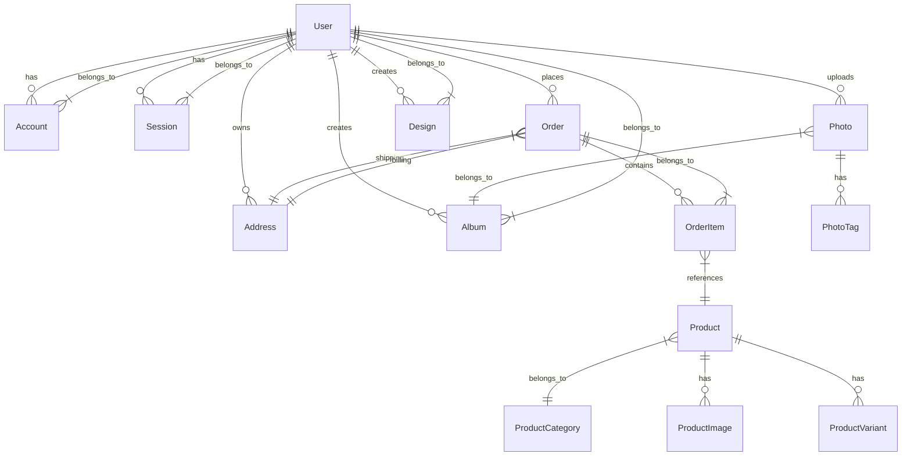

# Database Schema

This document describes the database schema for the Photo Book Creator application.

## Overview

The application uses PostgreSQL as its primary database with Prisma ORM for database access and migrations. The schema is defined in `prisma/schema.prisma`.

## Entity Relationship Diagram



## Tables

### User

Represents a registered user of the application.

| Column | Type | Constraints | Description |
|--------|------|-------------|-------------|
| id | String | Primary Key, Unique | Unique identifier for the user |
| email | String | Unique | User's email address |
| password | String | Optional | Hashed password (for email/password auth) |
| name | String | Optional | User's full name |
| image | String | Optional | URL to user's profile image |
| emailVerified | DateTime | Optional | Timestamp when email was verified |
| createdAt | DateTime | Default: now() | When the user was created |
| updatedAt | DateTime | updatedAt | When the user was last updated |

### Account

Stores OAuth account information for users.

| Column | Type | Constraints | Description |
|--------|------|-------------|-------------|
| id | String | Primary Key, Unique | Unique identifier for the account |
| userId | String | Foreign Key | Reference to User |
| type | String | | Account type (oauth, email, etc.) |
| provider | String | | OAuth provider (Google, Facebook, etc.) |
| providerAccountId | String | | Provider-specific account ID |
| refresh_token | String | Optional | OAuth refresh token |
| access_token | String | Optional | OAuth access token |
| expires_at | Int | Optional | Token expiration timestamp |
| token_type | String | Optional | Token type |
| scope | String | Optional | OAuth scope |
| id_token | String | Optional | ID token |
| session_state | String | Optional | Session state |
| createdAt | DateTime | Default: now() | When the account was created |
| updatedAt | DateTime | updatedAt | When the account was last updated |

### Session

Stores session information for authentication.

| Column | Type | Constraints | Description |
|--------|------|-------------|-------------|
| id | String | Primary Key, Unique | Unique identifier for the session |
| sessionToken | String | Unique | Session token |
| userId | String | Foreign Key | Reference to User |
| expires | DateTime | | When the session expires |
| createdAt | DateTime | Default: now() | When the session was created |
| updatedAt | DateTime | updatedAt | When the session was last updated |

### VerificationToken

Stores email verification tokens.

| Column | Type | Constraints | Description |
|--------|------|-------------|-------------|
| identifier | String | Primary Key | Identifier (usually email) |
| token | String | Unique | Verification token |
| expires | DateTime | | When the token expires |

### Address

Stores user addresses for shipping and billing.

| Column | Type | Constraints | Description |
|--------|------|-------------|-------------|
| id | String | Primary Key, Unique | Unique identifier for the address |
| userId | String | Foreign Key | Reference to User |
| name | String | Optional | Address name (Home, Office, etc.) |
| street | String | | Street address |
| city | String | | City |
| state | String | | State/Province |
| zipCode | String | | ZIP/Postal code |
| country | String | | Country |
| isDefault | Boolean | Default: false | Whether this is the default address |
| createdAt | DateTime | Default: now() | When the address was created |
| updatedAt | DateTime | updatedAt | When the address was last updated |

### Order

Represents a customer order.

| Column | Type | Constraints | Description |
|--------|------|-------------|-------------|
| id | String | Primary Key, Unique | Unique identifier for the order |
| userId | String | Foreign Key | Reference to User |
| status | OrderStatus | Default: PENDING | Order status |
| totalAmount | Float | | Total order amount |
| taxAmount | Float | Default: 0 | Tax amount |
| discount | Float | Default: 0 | Discount amount |
| currency | String | Default: "USD" | Currency code |
| paymentId | String | Optional | Payment provider ID |
| shippingAddressId | String | Optional, Foreign Key | Reference to Address |
| billingAddressId | String | Optional, Foreign Key | Reference to Address |
| trackingNumber | String | Optional | Shipping tracking number |
| createdAt | DateTime | Default: now() | When the order was created |
| updatedAt | DateTime | updatedAt | When the order was last updated |

### OrderItem

Represents an item in an order.

| Column | Type | Constraints | Description |
|--------|------|-------------|-------------|
| id | String | Primary Key, Unique | Unique identifier for the order item |
| orderId | String | Foreign Key | Reference to Order |
| productId | String | Foreign Key | Reference to Product |
| quantity | Int | | Quantity ordered |
| price | Float | | Price per item |
| createdAt | DateTime | Default: now() | When the order item was created |
| updatedAt | DateTime | updatedAt | When the order item was last updated |

### Product

Represents a product available for purchase.

| Column | Type | Constraints | Description |
|--------|------|-------------|-------------|
| id | String | Primary Key, Unique | Unique identifier for the product |
| name | String | | Product name |
| description | String | Optional | Product description |
| price | Float | | Base price |
| categoryId | String | Foreign Key | Reference to ProductCategory |
| isActive | Boolean | Default: true | Whether the product is active |
| createdAt | DateTime | Default: now() | When the product was created |
| updatedAt | DateTime | updatedAt | When the product was last updated |

### ProductCategory

Represents a category of products.

| Column | Type | Constraints | Description |
|--------|------|-------------|-------------|
| id | String | Primary Key, Unique | Unique identifier for the category |
| name | String | | Category name |
| slug | String | Unique | URL-friendly category name |
| description | String | Optional | Category description |
| createdAt | DateTime | Default: now() | When the category was created |
| updatedAt | DateTime | updatedAt | When the category was last updated |

### ProductImage

Stores images associated with products.

| Column | Type | Constraints | Description |
|--------|------|-------------|-------------|
| id | String | Primary Key, Unique | Unique identifier for the image |
| productId | String | Foreign Key | Reference to Product |
| url | String | | Image URL |
| alt | String | Optional | Alternative text |
| isPrimary | Boolean | Default: false | Whether this is the primary image |
| createdAt | DateTime | Default: now() | When the image was created |
| updatedAt | DateTime | updatedAt | When the image was last updated |

### ProductVariant

Represents a variant of a product (e.g., different sizes, colors).

| Column | Type | Constraints | Description |
|--------|------|-------------|-------------|
| id | String | Primary Key, Unique | Unique identifier for the variant |
| productId | String | Foreign Key | Reference to Product |
| name | String | | Variant name |
| price | Float | | Variant price |
| stock | Int | Default: 0 | Stock quantity |
| attributes | Json | Optional | Variant attributes (color, size, etc.) |
| createdAt | DateTime | Default: now() | When the variant was created |
| updatedAt | DateTime | updatedAt | When the variant was last updated |

### Photo

Represents a photo uploaded by a user.

| Column | Type | Constraints | Description |
|--------|------|-------------|-------------|
| id | String | Primary Key, Unique | Unique identifier for the photo |
| userId | String | Foreign Key | Reference to User |
| url | String | | Photo URL |
| name | String | Optional | Original file name |
| size | Int | Optional | File size in bytes |
| type | String | Optional | MIME type |
| albumId | String | Optional, Foreign Key | Reference to Album |
| createdAt | DateTime | Default: now() | When the photo was uploaded |
| updatedAt | DateTime | updatedAt | When the photo was last updated |

### Album

Represents a collection of photos.

| Column | Type | Constraints | Description |
|--------|------|-------------|-------------|
| id | String | Primary Key, Unique | Unique identifier for the album |
| userId | String | Foreign Key | Reference to User |
| name | String | | Album name |
| isPublic | Boolean | Default: false | Whether the album is public |
| createdAt | DateTime | Default: now() | When the album was created |
| updatedAt | DateTime | updatedAt | When the album was last updated |

### PhotoTag

Represents a tag that can be applied to photos.

| Column | Type | Constraints | Description |
|--------|------|-------------|-------------|
| id | String | Primary Key, Unique | Unique identifier for the tag |
| name | String | Unique | Tag name |
| createdAt | DateTime | Default: now() | When the tag was created |
| updatedAt | DateTime | updatedAt | When the tag was last updated |

### Design

Represents a photo book design created by a user.

| Column | Type | Constraints | Description |
|--------|------|-------------|-------------|
| id | String | Primary Key, Unique | Unique identifier for the design |
| userId | String | Foreign Key | Reference to User |
| name | String | | Design name |
| description | String | Optional | Design description |
| data | Json | | Design data (canvas elements, layout, etc.) |
| thumbnail | String | Optional | Thumbnail image URL |
| isPublic | Boolean | Default: false | Whether the design is public |
| createdAt | DateTime | Default: now() | When the design was created |
| updatedAt | DateTime | updatedAt | When the design was last updated |

## Enums

### OrderStatus

Possible values for order status:
- PENDING
- CONFIRMED
- PROCESSING
- SHIPPED
- DELIVERED
- CANCELLED

## Indexes

The following indexes are defined to optimize query performance:

1. User.email - Unique index for fast email lookups
2. Account.provider + Account.providerAccountId - Unique composite index
3. Session.sessionToken - Unique index
4. VerificationToken.token - Unique index
5. VerificationToken.identifier + VerificationToken.token - Primary key
6. ProductCategory.slug - Unique index
7. PhotoTag.name - Unique index

## Relations

The schema defines the following relations:

- User → Account (One-to-Many)
- User → Session (One-to-Many)
- User → Order (One-to-Many)
- User → Address (One-to-Many)
- User → Photo (One-to-Many)
- User → Album (One-to-Many)
- User → Design (One-to-Many)
- Account → User (Many-to-One)
- Session → User (Many-to-One)
- Order → OrderItem (One-to-Many)
- Order → Address (Many-to-One for both shipping and billing)
- OrderItem → Order (Many-to-One)
- OrderItem → Product (Many-to-One)
- Product → ProductCategory (Many-to-One)
- Product → ProductImage (One-to-Many)
- Product → ProductVariant (One-to-Many)
- ProductCategory → Product (One-to-Many)
- Photo → Album (Many-to-One)
- Photo → PhotoTag (Many-to-Many through implicit join table)
- Album → User (Many-to-One)
- Album → Photo (One-to-Many)
- PhotoTag → Photo (Many-to-Many through implicit join table)
- Design → User (Many-to-One)

## Migrations

Database migrations are managed using Prisma Migrate. To create a new migration:

```bash
npx prisma migrate dev --name migration_name
```

To apply migrations to a production database:

```bash
npx prisma migrate deploy
```